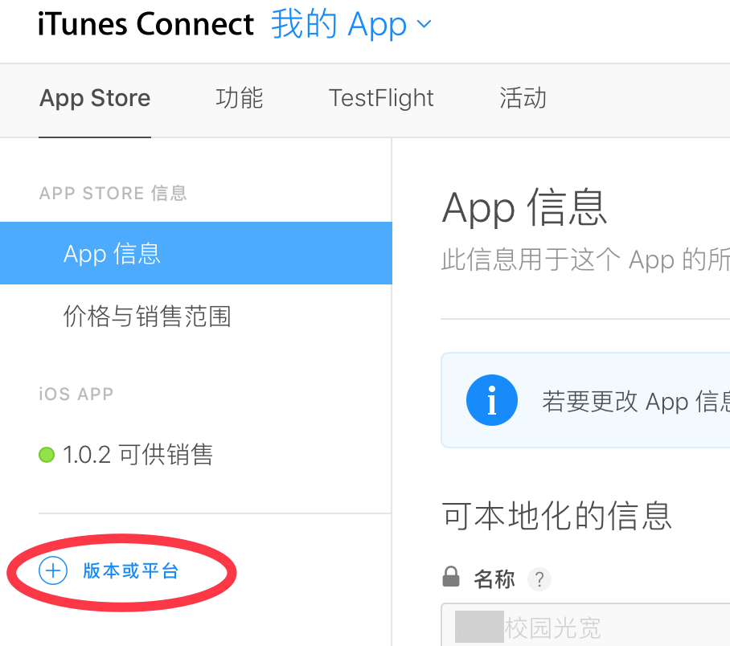
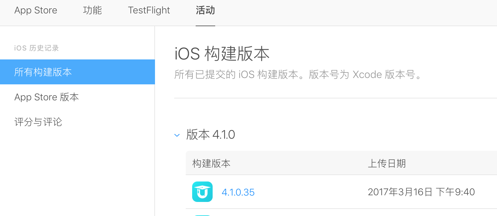

##版本发布
版本发布主要有如下几个阶段：

- 1、代码配置
- 2、工程配置
- 3、编译打包
- 4、上传itunesconnect
- 5、itunesconnect创建新版本
- 6、testflight内测／公测
- 7、itunesconnect提交审核
- 8、itunesconnect reject处理
- 9、itunesconnect版本发布
- 10、新版提醒json提交

###代码配置

配置product.h文件

	///////////////////////////////////////////////////
	// 顶级配置，0：代表发布，1：代表测试
	#define PRODUCT_TEST      0

product.h主要用来配置是否编译发布版本还是测试版本，需要与ProductConfig.h区分开，ProductConfig.h是配置使用什么服务器，是运营服还是测试服

###工程配置

咱们需要发布的app有三个：

- 掌上大学：这个是主要推广的app，需要重点关注
- Hi同学：相比前者，这个更多的是用于验证补丁、探测apple的审核底线（通过发布携带风险需求的功能，看会不会被reject）
- 校园云：跟Hi同学类似的情况

首先将这三个app对应的target的scheme的编译配置改为release；然后将三个target的code signing、Provisioning Profile配置成发布profile；对于掌上大学，会多一个PCShareExtension，同样也要配置code signing、Provisioning Profile；设备选择Generic iOS Device。接下来就可以编译了。

###编译打包

编译完成后，就生成了app包，拖拽到itunes里，就自动打成ipa包，这就是最终要提交的包。

###上传itunesconnect

使用Application Loader提交ipa包。

###itunesconnect创建新版本

###testflight内测／公测

上传ipa之后，在itunes里可以看到ipa的状态，刚上传完，状态会是“正在处理”，大概过半个小时，状态会发生变化。

然后就可以在testflight栏目配置选
。。。